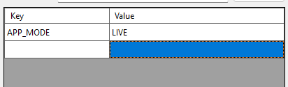

# .NET Core project builder

A simple Windows Forms application to publish publication packages of .NET Core projects. Simply load the .csproj file of any .NET Core C# projects, adjust flag or provide custom parameters, press Build and wait for it to complete. You can also review the build log if any error does occur during the build process.

## Requirement

Listed below is the required installed software for the application to be able to produce publication packages.

- **dotnet**: Since it's basically an interface to dotnet publish command, it's obvious that dotnet, as well as MSBuild, to be installed.
- **7-Zip**: The compression process uses 7-Zip to compress the build result.

## Build arguments

### Mandatory arguments

There are predefined build arguments that are viewed as mandatory to produce packages as consistent as possible.

- `--output`: to define the build result path so that the application is able to pickup the artifacts and compress as single zip archive.
- `--configuration Release`: for obvious reason, to build the project as _Release_ instead of _Debug_.
- `--runtime [RUNTIME]`: to define the target runtime. The application builds for 2 target runtime at the moment, for Windows and Linux, both for x64.

### Customisable arguments

There are several available build arguments to custom.

- **Force restore**: apply `--force` argument to forces all dependencies to be resolved even if the last restore was successful.
- **Self-contained**: apply `--self-contained true` argument to publishes the .NET runtime with the application so the runtime doesn't need to be installed on the target machine.
- **As single file**: add `-p:PublishSingleFile=true` parameter to packages the app into a platform-specific single-file executable.
- **Trimmed**: add `-p:PublishTrimmed=true` parameter to trims unused libraries to reduce the deployment size of an app when publishing a self-contained executable.

### Parameters

There's also a section to add custom parameter to be passed to _MSBuild_. Anything that goes into this section will be parsed as `-p:KEY=VALUE`. For example, from the image below, it will be parsed as `-p:APP_MODE=LIVE`.

## References

- [.NET on Microsoft website](https://dotnet.microsoft.com/)
- [7-Zip official website](https://www.7-zip.org/)
- [dotnet publish command documentation](https://learn.microsoft.com/en-us/dotnet/core/tools/dotnet-publish)
